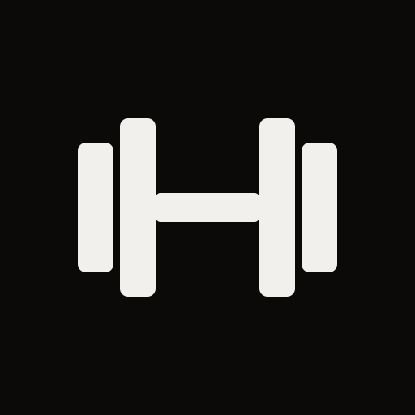

<p align="center">
  
</p>

<h1 align="center">open-fit</h1>

<p align="center">
  A gym log for your phone: which machine is next, what weight to use, and how recovered you are.<br>
  Offline-first. No account. Your data stays on your phone.
</p>

<p align="center"><a href="https://deutschmark.online/fit/"><b>Live demo</b></a></p>

---

Built for walking a big commercial gym floor with one hand free. Open it, it
tells you today's day, routes every exercise to a machine on your floor, and
suggests the weight for each set from what you did last time.

## What it does

- **A five-day split you can do in any order.** Miss a day and it waits for
  you; every day comes up once a round. Rename, reorder, add and remove days.
- **3 sets of 12 / 10 / 8 by default**, heavier each set. Each set progresses
  on its own: hit the target and that set goes up a step next time.
- **Machine routing.** Every exercise has an ordered list of machines. Machine
  taken? One tap moves you to the next one, with its own weight history.
- **Adding machines is a search.** Type what's on the sticker ("hammer
  incline", "pulldown", "insignia shoulder") and tap: a built-in catalog of
  common commercial-gym machines knows each one's type, muscles and
  exercises. Anything else: a name and what you do on it. A whole floor can
  arrive as one link (`npm run machine-link machines.json <your app url>`).
- **Recovery map.** Sets add fatigue per muscle and it fades over 48 to 72
  hours; a muscle that's still cooked gets a third fewer sets today.
- **How-to photos and steps** for every starter exercise.
- **Works offline** once loaded, and installs to your Home Screen.

The starter program is upper-body focused, machine-first (no barbell squats or
deadlifts), and leaves quad and calf work in the library: leg press, hack
squat, leg extension and calf raises are a tap away in **Program**.

## Run it

```bash
npm install
npm run dev
```

Open <http://localhost:5173>. Node 22.18 or newer.

`npm run build` writes a static site to `dist/`. Put it on any static host
(Cloudflare Pages, Netlify, GitHub Pages). Serving from a subfolder? Set
`base` in `vite.config.ts`.

## Your data

Everything lives in your browser's IndexedDB on your device. There is no
server, no analytics, and nothing to sign up for.

- **Add it to your Home Screen.** In a regular Safari tab, Safari can clear a
  site's data after a week without a visit; Home Screen apps are exempt.
- **Export / Import** in Settings writes and reads a JSON backup file.
- **Sync code (optional).** If you deploy the worker in [`sync/`](sync/), the
  app can keep an encrypted copy off your phone. It shows you a random
  10-character code (`7KQ2M-X9PDA`); type it on a new phone to get everything
  back. The code never leaves the device: it's stretched (PBKDF2-SHA256,
  600,000 rounds) into the storage id, a write token and an AES-GCM key
  (HKDF-SHA256). The server stores ciphertext and a hash of the token, and a
  copy can only be replaced at the version the device last saw. No account,
  no email. Lose the code and the copy can't be read by anyone, including you.

### Turning on sync

You need a free Cloudflare account.

```bash
cd sync
npm install
npx wrangler kv namespace create OPEN_FIT_SYNC   # paste the id into wrangler.toml
# set ALLOWED_ORIGINS in wrangler.toml to where your app is served
npx wrangler deploy
```

Then build the app with the worker's URL:

```bash
VITE_SYNC_URL=https://open-fit-sync.<you>.workers.dev npm run build
```

## Make it yours

- `src/lib/config.ts`: lock the gym name, turn ride tracking on by default,
  point at a sync server.
- `src/lib/seed.ts`: the starter machines, exercises and split.
- `npm test` runs the training logic and an end-to-end sync test (the real
  client against the real worker, in memory).

## Credits

Exercise photos and instructions come from
[free-exercise-db](https://github.com/yuhonas/free-exercise-db), released into
the public domain under The Unlicense. `npm run howto` rebuilds them.

The muscle map is drawn with anatomy paths from
[react-native-body-highlighter](https://github.com/HichamELBSI/react-native-body-highlighter)
(MIT, © 2022 ELABBASSI Hicham); the full notice is in `src/lib/bodyPaths.ts`.
`npm run bodymap` rebuilds them.

Equipment names in the starter list (Hammer Strength, Life Fitness) are
trademarks of their owners and are used only to describe common machines.
This project isn't affiliated with any gym or equipment maker, and it isn't
medical or training advice.

## License

[MIT](LICENSE)
